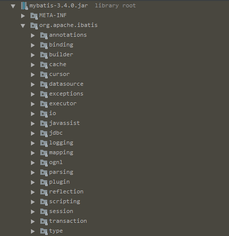
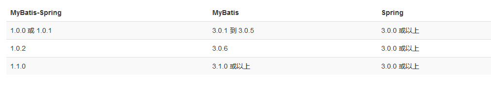

从Mybatis实例看原理
----
[目录]  
> [前言](#前言)  
> [mybatis结构](#mybatis结构介绍)  
> [写一个Hello Mybatis](#Hello Mybatis)  
> [与Spring集成](#与Spring集成)

###  前言
> 上一节针对Mybatis中主要的几个类进行了列举，我们再来回顾一下  
> * <code>Configuration</code>: Mybatis的配置信息都在该类中  
> * <code>SqlSession</code>: 作为MyBatis工作的主要顶层API，表示和数据库交互的会话，完成必要数据库增删改查功能，类似于connection
> * <code>Executor</code>: 执行器，是Mybatis 调度的核心，负责SQL语句的生成和查询缓存的维护
> * <code>StatementHandler</code>: 封装了JDBC Statement操作，负责对JDBC statement 的操作，如设置参数、将Statement结果集转换成List集合。  
> * <code>ParameterHandler</code>: 负责将用户传递的参数转换成JDBC statement锁需要的参数。  
> * <code>ResultHandler</code>: 负责将JDBC返回的ResultSet结果集装换为List集合
> * <code>TypeHandler</code>: 负责java数据类型和JDBC数据类型之间的映射和转化
> * <code>MappedStatement</code>: MappedStatement维护了一条<select|update|delete|insert>节点的封装  
> * <code>SqlSource</code>: 负责根据用户传递的parameterObject，动态地生成SQL语句，将信息封装到BoundSql对象中，并返回 
> * <code>BoundSql</code>: 表示动态生成的SQL语句以及相应的参数信息   

### mybatis结构介绍  
#### mybatis的架构图:  

   

> Mybatis的功能架构分为三层：
* API接口层：提供给外部使用的接口API，开发人员通过这些本地API来操纵数据库。接口层一接收到调用请求就会调用数据处理层来完成具体的数据处理。  
* 数据处理层：负责具体的SQL查找、SQL解析、SQL执行和执行结果映射处理等。它主要的目的是根据调用的请求完成一次数据库操作。  
* 基础支撑层：负责最基础的功能支撑，包括连接管理、事务管理、配置加载和缓存处理，这些都是共用的东西，将他们抽取出来作为最基础的组件。为上层的数据处理层提供最基础的支撑。 
 
#### MyBatis整个项目的包结构如下：  

    

>  1.annotation   

 本包定义了Mybatis框架中的24个注解: ``Cache``,``Mapper``,``Select``等。    
    
>  2.binding  
  
   映射绑定Mapper接口与mapper.xml。   
   
> 3.builder  
  
   解析Mybatis的配置文件和映射文件，包括Xml格式和Annotation格式2种配置。
       
> 4.cache    

   * 本包包含了Mybatis框架的缓存接口定义和实现。    
   * 缓存实现为``PerpetualCache``类，它直接实现了Cache接口，其它缓存类实现采用装饰模式实现。一个个包装起来，形成一个链，典型的就是SynchronizedCache->LoggingCache->SerializedCache->LruCache->PerpetualCache，通过链起来达到功能增加。      
   * 缓存框架按照 Key-Value方式存储，Key的生成采取规则为：[hashcode:checksum:mappedStementId:offset:limit:executeSql:queryParams]。    
   
> 5.datasource  
    
   数据源相关接口和类。   
   
> 6.exceptions  
    
   本包定义了Mybatis框架中的异常。    

> 7.executor  
    
   Mybatis最后中的四个接口(``Executor``,``StatementHandler``,``ParameterHandler``,``ResultSetHandler``)以及实现。    

> 8.io  
    
   本包主要包含了资源加载和访问相关的类。    

> 9.jdbc  
    
   JDBC和SQL相关的类。    
   
> 10.logging  
    
   把日志抽象成Log接口，该接口有7种实现。    
    1.Apache Commons Logging    
    2.JDBC Logging    
    3.Java Util Logging    
    4.Log4j    
    5.No Logging    
    6.Slf4J    
    7.Stdout    
   
> 11.mapping  
    
   Mybatis配置文件, 映射文件相关的类。    

> 12.ognl        

   ongl表达式处理   
   
> 13.parsing      

   解析配置文件的核心类和接口。    

> 14.plugin      

  插件相关接口和类。    

> 15.reflection  
    
   反射处理相关类。    

> 16.scripting  
    
   脚本解析相关类。    

> 17.session  
      
   会话相关类，提供对外核心接口.    

> 18.transaction  
    
   Transaction接口是对事务的抽象，有2种实现方式：    
   1.JdbcTransaction,jdbc:手动管理    
   2.ManagedTransaction,managed:container manage the full lifecycle of the transaction    
   TransactionFactory接口定义了生成Transaction接口(实现类)的若干方法。    
   该接口有2种实现方式：    
   1.JdbcTransactionFactory,Creates {@link JdbcTransaction} instances。    
   2.ManagedTransactionFactory，Creates {@link ManagedTransaction} instances。    
   本包主要依赖了Mybatis session包的TransactionIsolationLevel和exceptions包的PersistenceException。    
   Mybatis的其它包大量引用了本包中的类和接口，即严重依赖于本包。    

> 19.type  
    
  类型转换处理，包含了类型处理器接口TypeHandler，父类BaseTypeHandler,以及若干个子类。       
    
    
    
    
### Hello Mybatis
> 还是老套路，先来玩一玩Mybatis，看一个Demo
> 参照[官网](http://www.mybatis.org/mybatis-3/zh/index.html),需要以下几个步骤：  
> 1.引入依赖  
```
    <dependency>
      <groupId>org.mybatis</groupId>
      <artifactId>mybatis</artifactId>
      <version>x.x.x</version>
    </dependency>
```
> 2.配置mybatis-config.xml 
```xml
    <?xml version="1.0" encoding="UTF-8" ?>
    <!DOCTYPE configuration PUBLIC "-//mybatis.org//DTD Config 3.0//EN" "http://mybatis.org/dtd/mybatis-3-config.dtd">
    <configuration>
      <environments default="development">
        <environment id="development">
          <transactionManager type="JDBC"/>
          <dataSource type="POOLED">
            <property name="driver" value="${driver}"/>
            <property name="url" value="${url}"/>
            <property name="username" value="${username}"/>
            <property name="password" value="${password}"/>
          </dataSource>
        </environment>
      </environments>
      <mappers>
        <mapper resource="org/mybatis/example/BlogMapper.xml"/>
      </mappers>
    </configuration>
```

> 3.编写Mapper接口  
> 注：该接口不用提供实现类，只是提供一个映射关系，mybatis会自动解析该映射关系来调用相关的sql语句  
```java
    package org.mybatis.example;

    public interface BlogMapper{
        Blog selectBlog(@org.apache.ibatis.annotations.Param("id")Integer id);
    }
```

> 4.编写mapper.xml  
> 注意：该xml文件需要在配置文件中的mappers节点下注册  
```xml
    <?xml version="1.0" encoding="UTF-8" ?>
    <!DOCTYPE mapper PUBLIC "-//mybatis.org//DTD Mapper 3.0//EN" "http://mybatis.org/dtd/mybatis-3-mapper.dtd">
    <mapper namespace="org.mybatis.example.BlogMapper">
      <select id="selectBlog" resultType="Blog">
        select * from Blog where id = #{id}
      </select>
    </mapper>
```
> 5.加载配置文件,构建SqlSessionFactory  
```
    String resource = "org/mybatis/example/mybatis-config.xml";
    InputStream inputStream = Resources.getResourceAsStream(resource);
    SqlSessionFactory sqlSessionFactory = new SqlSessionFactoryBuilder().build(inputStream);
```
> 6.从SqlSessionFactory中获取会话SqlSession  
```
    // 采用直接指定sqlid的方式
    SqlSession session = sqlSessionFactory.openSession();
    try {
      Blog blog = (Blog) session.selectOne("org.mybatis.example.BlogMapper.selectBlog", 101);
    } finally {
      session.close();
    }
    
    //采用接口的方式
    SqlSession session = sqlSessionFactory.openSession();
    try {
      BlogMapper mapper = session.getMapper(BlogMapper.class);
      Blog blog = mapper.selectBlog(101);
    } finally {
      session.close();
    }
```
> 自此一个简单的Demo就完成了

### 与Spring集成  
> 在开发中我们一般不会单独使用Mybatis,都是利用Spring强大的IOC和AOP来帮助我们快速的构建项目，我们来看看如何与Spring集成  
> 先看看版本之间的对应关系  
    
> 1.添加依赖  
```xml
          <!-- 导入database依赖,使用druid作连接池 -->
          <dependency>
              <groupId>com.alibaba</groupId>
              <artifactId>druid</artifactId>
              <version>1.1.3</version>
          </dependency>
          <dependency>
              <groupId>org.mybatis</groupId>
              <artifactId>mybatis-spring</artifactId>
              <version>1.3.1</version>
          </dependency>
          <dependency>
              <groupId>mysql</groupId>
              <artifactId>mysql-connector-java</artifactId>
              <version>5.1.44</version>
          </dependency>
          <dependency>
              <groupId>org.mybatis</groupId>
              <artifactId>mybatis</artifactId>
              <version>3.4.1</version>
          </dependency>
          <dependency>
              <groupId>org.springframework</groupId>
              <artifactId>spring-jdbc</artifactId>
              <version>4.3.10.RELEASE</version>
          </dependency>
```  
> 2.配置SqlSessionFactory  
> 在spring的配置文件application-context.xml中配置如下内容  
```xml
       <?xml version="1.0" encoding="UTF-8"?>
       <!-- 引入配置文件 -->
       <beans xmlns="http://www.springframework.org/schema/beans"
              xmlns:xsi="http://www.w3.org/2001/XMLSchema-instance"
              xsi:schemaLocation="http://www.springframework.org/schema/beans http://www.springframework.org/schema/beans/spring-beans.xsd">
       
           <!-- 引入配置文件 -->
           <bean id="propertyConfigurer" class="org.springframework.beans.factory.config.PropertyPlaceholderConfigurer">
               <property name="location" value="classpath:/mybatis/db.properties"/>
           </bean>
       
           <!-- dataSource配置 -->
           <bean id="dataSource" class="com.alibaba.druid.pool.DruidDataSource"
                 init-method="init" destroy-method="close">
               <property name="driverClassName" value="${jdbc.driverClassName}"/>
               <property name="url" value="${jdbc.url}"/>
               <property name="username" value="${jdbc.username}"/>
               <property name="password" value="${jdbc.password}"/>
       
               <property name="filters" value="log4j"/>
               <property name="maxActive" value="5"/>
               <property name="initialSize" value="1"/>
               <property name="maxWait" value="6000"/>
           </bean>
       
           <!-- mybatis配置,mapper.xml文件扫描 -->
           <bean id="sessionFactory" class="org.mybatis.spring.SqlSessionFactoryBean">
               <property name="configLocation" value="classpath:/mybatis/mybatis-config.xml"/>
               <property name="dataSource" ref="dataSource"/>
           </bean>
       </beans>
```
> 3.使用  
```java
    package com.company.repo;
    import org.apache.ibatis.session.*;
    import org.springframework.beans.factory.annotation.*;
    /**
    * 抽象 
    */
    public abstract class AbstractRepository{
        protected SqlSessionFactory sqlSessionFactory;
        
        @Autowired
        @Qualifier("sqlSessionFactory")
        public void setSqlSessionFacto(SqlSessionFactory sqlSessionFactory){
            this.sqlSessionFactory = sqlSessionFactory;
        }
    } 
```  
```java
    @org.springframework.stereotype.Repository
    public class BlogRepository extends AbstactRepository{
        public Blog findById(Integer id){
            try(org.apache.ibatis.session.SqlSession sqlSession = sqlSessionFactory.openSession()){
                BlogMapper mapper = sqlSession.getMapper(BlogMapper.class);
                return mapper.findById(id);
            }
        }
    }       
```  
> 这样一个与Spring集成，简单的使用实例就完成了，复杂的就看各位的了。  
> 下一节将针对配置文件mybatis-config.xml进行说明