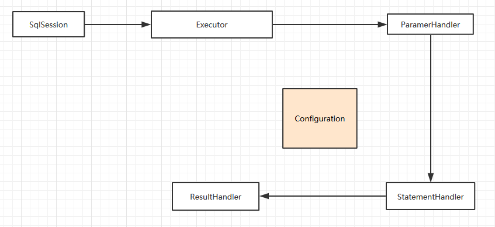

执行流程分析
-------  
> 既然mybatis是针对JDBC操作的封装，那我们接下来就拨看云雾见阳光的看看mybatis是如何一步一步的做这些事情的，我们以查询为例。  
### 引言    

>先看一下基础的jdbc操作有那几个步骤：  
>> **Step1**. 获取连接  
>> **Step2**. 获取执行动态sql  
>> **Step3**. 构建预编译对象PrepareStatement
>> **Step4**. 设置动态参数  
>> **Step5**. 通过连接发送执行请求到数据库  
>> **Step6**. 数据库返回结果集，编辑解析返回结果  
>> **Step7**. 关闭连接  
  
> 我们如何用mybatis做数据库查询呢？
```java
    public class MybatisDemo{
        public static void main(String[] args){
            String resource = "mybatis-config.xml";
            InputStream inputStream = Resources.getResourceAsStream(resource);
            SqlSessionFactory sqlSessionFactory = new SqlSessionFactoryBuilder().build(inputStream);
            
            try( SqlSession openSession = sqlSessionFactory.openSession() ){
                 User user = openSession.<User>selectOne("com.study.mybatis.mapper.UserMapper.select", 1);
                 System.out.println(user);
            }
        }
    }
```  
> 我们一步一步来解读mybatis具体的查询流程（以id方式为例，Mapper接口方式后面分析）  

### 正文

#### 1.获取SqlSession  
> 在mybatis中连接被抽象为SqlSession,但是并不是真正意义上的connection，其通过SqlSessionFactoy.openSession()获取SqlSession。  

#### 2.获取执行sql  
> 在mybatis中我们是通过mapper.xml来配置sql语句的，而mybatis会通过解析将这些sql语句映射为MappedStatement,一个MappedStatement维护了一条<select|update|delete|insert>节点的封装  
> 我们通过namespace+id去获取一个MappedStatement  
```
//Configuration.class
 public MappedStatement getMappedStatement(String id, boolean validateIncompleteStatements) {
    if (validateIncompleteStatements) {
      buildAllStatements();
    }
    return mappedStatements.get(id);
  }
```

#### 3. 调用查询方法  

```
//DefaultSqlSession.class
@Override
  public <E> List<E> selectList(String statement, Object parameter, RowBounds rowBounds) {
    try {
      MappedStatement ms = configuration.getMappedStatement(statement);
      return executor.query(ms, wrapCollection(parameter), rowBounds, Executor.NO_RESULT_HANDLER);
    } catch (Exception e) {
      throw ExceptionFactory.wrapException("Error querying database.  Cause: " + e, e);
    } finally {
      ErrorContext.instance().reset();
    }
  }
 ```
 > SqlSession的查询其实质是委托给Executor去执行了，接着来看*Executor*的query方法  
 ```
    @Override
    public <E> List<E> query(MappedStatement ms, Object parameter, RowBounds rowBounds, ResultHandler resultHandler) throws SQLException {
      BoundSql boundSql = ms.getBoundSql(parameter);
      CacheKey key = createCacheKey(ms, parameter, rowBounds, boundSql);
      return query(ms, parameter, rowBounds, resultHandler, key, boundSql);
   }
  
    @SuppressWarnings("unchecked")
    @Override
    public <E> List<E> query(MappedStatement ms, Object parameter, RowBounds rowBounds, ResultHandler resultHandler, CacheKey key, BoundSql boundSql) throws SQLException {
      ErrorContext.instance().resource(ms.getResource()).activity("executing a query").object(ms.getId());
      if (closed) {
        throw new ExecutorException("Executor was closed.");
      }
      if (queryStack == 0 && ms.isFlushCacheRequired()) {
        clearLocalCache();
      }
      List<E> list;
      try {
        queryStack++;
        //查询缓存
        list = resultHandler == null ? (List<E>) localCache.getObject(key) : null;
        if (list != null) {
          handleLocallyCachedOutputParameters(ms, key, parameter, boundSql);
        } else {
          //缓存不存在，查库
          list = queryFromDatabase(ms, parameter, rowBounds, resultHandler, key, boundSql);
        }
      } finally {
        queryStack--;
      }
      if (queryStack == 0) {
        for (DeferredLoad deferredLoad : deferredLoads) {
          deferredLoad.load();
        }
        // issue #601
        deferredLoads.clear();
        
        //清除二级缓存
        if (configuration.getLocalCacheScope() == LocalCacheScope.STATEMENT) {
          // issue #482
          clearLocalCache();
        }
      }
      return list;
    }
    
    
     @Override
      public <E> List<E> query(Statement statement, ResultHandler resultHandler) throws SQLException {
        PreparedStatement ps = (PreparedStatement) statement;
        ps.execute();
        return resultSetHandler.<E> handleResultSets(ps);
      }
      
      private <E> List<E> queryFromDatabase(MappedStatement ms, Object parameter, RowBounds rowBounds, ResultHandler resultHandler, CacheKey key, BoundSql boundSql) throws SQLException {
          List<E> list;
          localCache.putObject(key, EXECUTION_PLACEHOLDER);
          try {
            list = doQuery(ms, parameter, rowBounds, resultHandler, boundSql);
          } finally {
            localCache.removeObject(key);
          }
          localCache.putObject(key, list);
          if (ms.getStatementType() == StatementType.CALLABLE) {
            localOutputParameterCache.putObject(key, parameter);
          }
          return list;
        }
```
> BaseExecutor提供模板方法，不同的子类实现不同的doQuery回调接口，我们就看SimpleExecutor类       
```
         @Override
          public <E> List<E> doQuery(MappedStatement ms, Object parameter, RowBounds rowBounds, ResultHandler resultHandler, BoundSql boundSql) throws SQLException {
            Statement stmt = null;
            try {
              Configuration configuration = ms.getConfiguration();
              //生成StatementHandler代理对象
              StatementHandler handler = configuration.newStatementHandler(wrapper, ms, parameter, rowBounds, resultHandler, boundSql);
             
              //利用ParameterHandler完成参数的注入，返回Statement对象
              stmt = prepareStatement(handler, ms.getStatementLog());
              
              return handler.<E>query(stmt, resultHandler);
            } finally {
              closeStatement(stmt);
            }
          }
```

> sql交由相应的StatementHandler代理对象执行
```          
           @Override
            public <E> List<E> query(Statement statement, ResultHandler resultHandler) throws SQLException {
              String sql = boundSql.getSql();
              //执行sql
              statement.execute(sql);
              
              //交由ResultSetHandler完成结果集的映射，最后返回
              return resultSetHandler.<E>handleResultSets(statement);
            }
 ```
 ### 总结
 > 自此一个简单的执行流程就分析结束了 ，我们来梳理一下流程（如图）:  
 
 >>* 1.加载配置文件  
 >>* 2.通过SqlSessionFactroy获取SqlSession  
 >>* 3.通过SqlSession调用方法，传入mapper.xml配置的namespace+id, 动态参数列表  
 >>* 4.SqlSession委托给Executor代理对象去执行  
 >>* 5.调用相应的ParameterHandler代理对象完成参数的注入  
 >>* 6.委托StatementHandler代理对象完成数据库执行  
 >>* 7.委托ResultSetHandler代理对象完成结果集的映射操作  
 