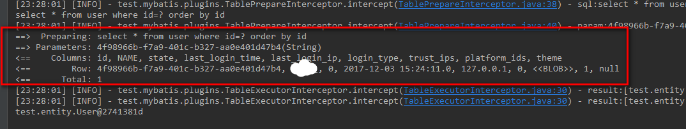
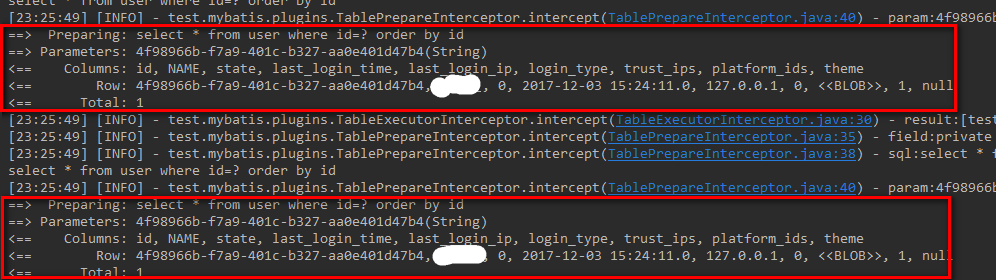
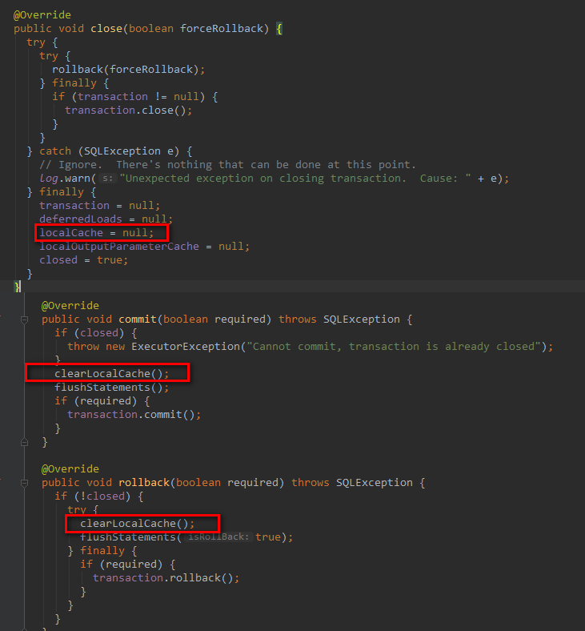

拓展-缓存(一级缓存)
------
> 目录  
>> * [前言](#前言)  
>> * [正文](#正文)  
>>> * [使用一级缓存](#使用一级缓存)  
>>> * [一级缓存原理分析](#一级缓存原理分析)  
>>> * [一级缓存的声明周期](#一级缓存的声明周期)  
>> * [总结](#总结)  

## 前言
> 前面几节，我们针对mybatis的执行流程，sql配置做了介绍。我们知道，mybatis是一个高效的orm框架，除了前几届了解到的功能，为了提高查询性能，mybatis也提供了缓存的功能，本节我们就一起来探究一下。  

## 正文
> 我们在系统的运行过程中，总是会出现这样的情况：多次执行完全相同的查询语句，尤其是那种数据变化不大，读多写少的场景，重复的查库会增加系统的开销，自然我们就想到了使用缓存。mybatis就为我们提供了一级缓存和二级缓存的功能（实际生产中建议关闭缓存功能，让更专业的工具去做缓存的功能），本节我们来了解一下一级缓存。  

### 使用一级缓存  
> 在[mybatis配置文件分析](03-mybatis-config.xml的配置介绍.md)中介绍过缓存的配置  

> * 配置开启一级缓存
```xml
    <?xml version="1.0" encoding="UTF-8" ?>
    <!DOCTYPE configuration PUBLIC "-//mybatis.org//DTD Config 3.0//EN" "http://mybatis.org/dtd/mybatis-3-config.dtd">
    <configuration>
    	<settings>
    		<!-- 打印查询语句-->
            <setting name="logImpl" value="STDOUT_LOGGING" />
    		<!-- 共有2个选项，SESSION和STATEMENT,默认SESSION -->
            <setting name="localCacheScope" value="SESSION"/>
    	</settings>
    	<mappers>
    		<mapper resource="mapper/UserMapper.xml" />
    	</mappers>
    </configuration>
    
```
> * 我们在同一个sqlSession中执行相同的sql  
```
    @Test
    public void mapperTest() {
        SqlSessionFactory sqlSessionFactory = application.getBean(SqlSessionFactory.class);
        SqlSession sqlSession = sqlSessionFactory.openSession();
        try {
            UserMapper userMapper = sqlSession.getMapper(UserMapper.class);
            User user = userMapper.getById("4f98966b-f7a9-401c-b327-aa0e401d47b4");
            userMapper.getById("4f98966b-f7a9-401c-b327-aa0e401d47b4");

            System.out.println(user);
        } catch (Exception e) {
            e.printStackTrace();
        } finally {
            sqlSession.close();
        }
    }
```
查看数据库执行，发现只执行了一次：    

之后改变localCacheScope为STATEMENT,发现执行了多次: 接下来我们来分析一级缓存是如何实现的。  

### 一级缓存原理分析   
> 在[Mybati执行流程分析](04-01_执行流程解读.md)我们分析过，通过SqlSession去执行查询，最终会委托给Executor,我们发现一级缓存就属于Session级别，在同一个Sessino会话中有效，并且缓存信息存储在Executor中，来看一下查询流程：  
```
    //BaseExecutor.class
    public <E> List<E> query(MappedStatement ms, Object parameter, RowBounds rowBounds, ResultHandler resultHandler, CacheKey key, BoundSql boundSql) throws SQLException {
        //去除多余代码，保留主要代码段
        
        //判断是否需要清除缓存，可以在配置sql语句是执行flushCahe=true,默认为false
        if (queryStack == 0 && ms.isFlushCacheRequired()) {
          clearLocalCache();
        }
        
        List<E> list;
        //查询缓存
        list = resultHandler == null ? (List<E>) localCache.getObject(key) : null;
        
        if (list != null) {
          //缓存存在
          handleLocallyCachedOutputParameters(ms, key, parameter, boundSql);
        } else {
          //缓存不存在，查库
          list = queryFromDatabase(ms, parameter, rowBounds, resultHandler, key, boundSql);
        }
        
        //判断是否缓存结果，理论上都会缓存，只是设置了localCacheScope=STATEMENT会清除缓存
        if (configuration.getLocalCacheScope() == LocalCacheScope.STATEMENT) {
          clearLocalCache();
        }
        return list;
    }
      
    private <E> List<E> queryFromDatabase(MappedStatement ms, Object parameter, RowBounds rowBounds, ResultHandler resultHandler, CacheKey key, BoundSql boundSql) throws SQLException {
        List<E> list;
        localCache.putObject(key, EXECUTION_PLACEHOLDER);
        try {
          list = doQuery(ms, parameter, rowBounds, resultHandler, boundSql);
        } finally {
          localCache.removeObject(key);
        }
        //一级缓存，缓存查询结果
        localCache.putObject(key, list);
        if (ms.getStatementType() == StatementType.CALLABLE) {
          localOutputParameterCache.putObject(key, parameter);
        }
        return list;
      }
```
> 我们来看看这个缓存的Key和实现原理，首先看Key的生成：   
```
//BaseExecutor.class
/**
* 使用id+offset+limit+sql+params来标示一次查询
*/
 public CacheKey createCacheKey(MappedStatement ms, Object parameterObject, RowBounds rowBounds, BoundSql boundSql) {
    if (closed) {
      throw new ExecutorException("Executor was closed.");
    }
    CacheKey cacheKey = new CacheKey();
    cacheKey.update(ms.getId());
    cacheKey.update(Integer.valueOf(rowBounds.getOffset()));
    cacheKey.update(Integer.valueOf(rowBounds.getLimit()));
    cacheKey.update(boundSql.getSql());
    List<ParameterMapping> parameterMappings = boundSql.getParameterMappings();
    TypeHandlerRegistry typeHandlerRegistry = ms.getConfiguration().getTypeHandlerRegistry();
    // mimic DefaultParameterHandler logic
    for (int i = 0; i < parameterMappings.size(); i++) {
      ParameterMapping parameterMapping = parameterMappings.get(i);
      if (parameterMapping.getMode() != ParameterMode.OUT) {
        Object value;
        String propertyName = parameterMapping.getProperty();
        if (boundSql.hasAdditionalParameter(propertyName)) {
          value = boundSql.getAdditionalParameter(propertyName);
        } else if (parameterObject == null) {
          value = null;
        } else if (typeHandlerRegistry.hasTypeHandler(parameterObject.getClass())) {
          value = parameterObject;
        } else {
          MetaObject metaObject = configuration.newMetaObject(parameterObject);
          value = metaObject.getValue(propertyName);
        }
        cacheKey.update(value);
      }
    }
    if (configuration.getEnvironment() != null) {
      // issue #176
      cacheKey.update(configuration.getEnvironment().getId());
    }
    return cacheKey;
  }
```
```java
    public class CacheKey implements Cloneable, Serializable {
      private List<Object> updateList;//用于存储参数列表
      /**
      * 只关注重要的方法，其余的在此忽略....
      */
    
      //只是简单的将参数依次加入到List中
      public void update(Object object) {
        // 参数是Array，依次顺序追加之
        if (object != null && object.getClass().isArray()) {
          int length = Array.getLength(object);
          for (int i = 0; i < length; i++) {
            Object element = Array.get(object, i);
            doUpdate(element);
          }
        } else {
          doUpdate(object);
        }
      }
    
      private void doUpdate(Object object) {
        int baseHashCode = object == null ? 1 : object.hashCode();
        count++;
        checksum += baseHashCode;
        baseHashCode *= count;
        hashcode = multiplier * hashcode + baseHashCode;
        updateList.add(object);
      }
    
      /**
      * 重要的方法：简单依次对比List中元素是否相等即可判断出sql是否相同
       */
      @Override
      public boolean equals(Object object) {
        if (this == object) {
          return true;
        }
        if (!(object instanceof CacheKey)) {
          return false;
        }
        final CacheKey cacheKey = (CacheKey) object;
        if (hashcode != cacheKey.hashcode) {
          return false;
        }
        if (checksum != cacheKey.checksum) {
          return false;
        }
        if (count != cacheKey.count) {
          return false;
        }
    
        for (int i = 0; i < updateList.size(); i++) {
          Object thisObject = updateList.get(i);
          Object thatObject = cacheKey.updateList.get(i);
          if (thisObject == null) {
            if (thatObject != null) {
              return false;
            }
          } else {
            if (!thisObject.equals(thatObject)) {
              return false;
            }
          }
        }
        return true;
      }
    }
```
可以看到，key是通过``statementId+offset+limit+sql+params``这几个条件决定，通过List将他们存储起来，对比相同只需要依次对比List中的元素是否相等即可判断是否为同一执行sql.  
> 深入看缓存存储实现localCache,发现是``PerpetualCache``类，来一探究竟  
```java
    public class PerpetualCache implements Cache {
      private Map<Object, Object> cache = new HashMap<Object, Object>();
       // 忽略一些方法，只关注重要的方法 
      @Override
      public void putObject(Object key, Object value) {
        cache.put(key, value);
      }
    
      @Override
      public Object getObject(Object key) {
        return cache.get(key);
      }
    
      @Override
      public Object removeObject(Object key) {
        return cache.remove(key);
      }
    
      @Override
      public void clear() {
        cache.clear();
      }
    }
```
> 恍然大悟，原来就是通过HashMap来存储sqlKey=result键值对。     

### 一级缓存的声明周期
> 那么问题来了，既然有缓存，那缓存什么时候被清理呢？缓存的生命周期又是什么呢？看来我们还需要继续探索。我们继续在``BaseExecutor``中找线索,发现``commit``,``rollback``,``close``这三个方法中清除了缓存   
  
既然清理缓存是在这三个方法中，那这三个方法什么时候被调用呢？很容易通过SqlSession接口就知道如下调用规则： 

| sql类型 | 调用方法 |    
|:--:|:--|  
| select | close |   
| update | commit,rollback,close |   
| delete | commit,rollback,close |   
> 所以我们得出结论：   
* 一级缓存声明周期是在session级别(因为session调用最终都会调用close方法清除缓存)。  
* 一级缓存在执行update,delete操作时会被清除。  

## 总结  
> 一级缓存的流程：  
> *  对于某个Select Statement，根据该Statement生成key。  
> *  判断在Local Cache中,该key是否用对应的数据存在。  
>> *  如果命中，则跳过查询数据库，继续往下走。  
>> *  如果没命中：
>>> * 去数据库中查询数据，得到查询结果
>>> * 将key和查询到的结果作为key和value，放入Local Cache中
>>> * 将查询结果返回
>> *  判断缓存级别是否为STATEMENT级别，如果是的话，清空本地缓存   

> 一级缓存的特点：  
>* Mybatis一级缓存的生命周期和SqlSession一致，即只能在同一个sqlSession中共享缓存数据，存储在BaseExecutor中。  
>* Mybatis的一级缓存是一个粗粒度的缓存，没有更新缓存和缓存过期的概念，同时只是使用了默认的hashmap，也没有做容量上的限定。  
>* Mybatis的一级缓存最大范围是SqlSession内部，有多个SqlSession或者分布式的环境下，有操作数据库写的话，会引起脏数据，建议是把一级缓存的默认级别设定为Statement，即不使用一级缓存。  
>* Mybatis的一级缓存不能人为干预，即无论设置了flushCache=true还是cacheScope=STATEMENT都不能阻止mybatis缓存查询结果，只能是控制在下一次查询时提前清空缓存，达到最终结果上的无缓存。    
 
