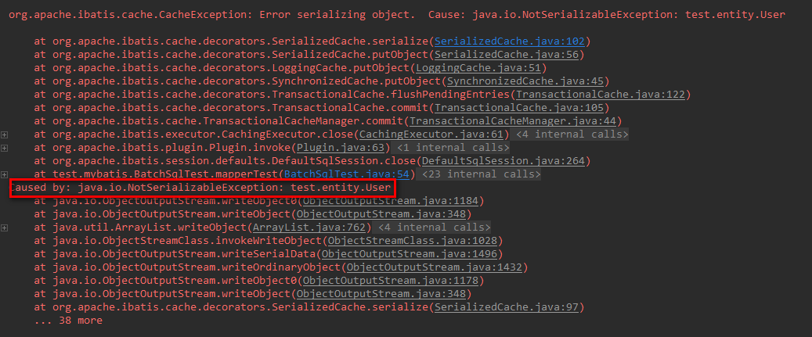

拓展-缓存(二级缓存)
------
> 目录  
>> * [前言](#前言)  
>> * [正文](#二级缓存)  
>>> * [使用二级缓存](#使用二级缓存)  
>>> * [二级缓存原理分析](#二级缓存原理分析)  
>>> * [二级缓存的生命周期](#二级缓存的生命周期)  
>> * [总结](#总结)  

## 前言
> 上节我们针对一级缓存的原理做了探究，本节我们就一起来探究一下二级缓存。  

## 二级缓存  
### 使用二级缓存  
> 在[mybatis配置文件分析](03-mybatis-config.xml的配置介绍.md)中介绍过缓存的配置  
> 1.mapper-config.xml配置开启二级缓存
```xml
    <?xml version="1.0" encoding="UTF-8" ?>
    <!DOCTYPE configuration PUBLIC "-//mybatis.org//DTD Config 3.0//EN" "http://mybatis.org/dtd/mybatis-3-config.dtd">
    <configuration>
    	<settings>
    		<!-- 打印查询语句-->
            <setting name="logImpl" value="STDOUT_LOGGING" />
    		<!-- 二级缓存,默认true -->
            <setting name="cacheEnabled" value="true"/>
    	</settings>
    	<mappers>
    		<mapper resource="mapper/UserMapper.xml" />
    	</mappers>
    </configuration>
    
```  

> 2.在Mybatis的映射XML中配置cache或者 cache-ref 。
```
    <cache/> 
    或
    <cache-ref namespace="mapper.UserMapper"/>
```     

cache标签用于声明这个namespace使用二级缓存，并且可以自定义配置。  
* type: cache使用的类型，默认是PerpetualCache，这在一级缓存中提到过。  
* eviction: 定义回收的策略，常见的有FIFO，LRU。  
* flushInterval: 配置一定时间自动刷新缓存，单位是毫秒  
* size: 最多缓存对象的个数  
* readOnly: 是否只读，若配置可读写，则需要对应的实体类能够序列化。  
* blocking: 若缓存中找不到对应的key，是否会一直blocking，直到有对应的数据进入缓存。  

> 3.测试使用  
```
    @Test
    public void mapperTest() {
        SqlSessionFactory sqlSessionFactory = application.getBean(SqlSessionFactory.class);
        SqlSession sqlSession = sqlSessionFactory.openSession();
        SqlSession sqlSession1 = sqlSessionFactory.openSession();
        try {
            UserMapper userMapper = sqlSession.getMapper(UserMapper.class);
            UserMapper userMapper1 = sqlSession1.getMapper(UserMapper.class);
            User user = userMapper.getById("4f98966b-f7a9-401c-b327-aa0e401d47b4");
            //sqlSession.commit();
            User user1 = userMapper1.getById("4f98966b-f7a9-401c-b327-aa0e401d47b4");
        } catch (Exception e) {
            e.printStackTrace();
        } finally {
            sqlSession.close();
        }
    }
```
执行发现报错：  
   
发现是因为二级缓存实体需要实现序列化，实现序列化后发现缓存没有生效，神奇了  

    
最后发现是因为第一个事务没有``commit``导致的，修改代码先提交事务1，再查询事务2，发现二级缓存生效，至于为什么要commit，先留个悬念，后面分析原理再说明   


### 二级缓存原理分析   
Mybatis二级缓存的工作流程和前文提到的一级缓存类似，只是在一级缓存处理前，用CachingExecutor装饰了BaseExecutor的子类，实现了缓存的查询和写入功能。   
  

> 来看``CachingExecutor``类，这是一个装饰者模式的应用      
```java
    public class CachingExecutor implements Executor {
      private Executor delegate;//装饰的对象
      //管理缓存
      private TransactionalCacheManager tcm = new TransactionalCacheManager();
      
      /***
      * 部分方法代码已经省略，这里只关注重要的方法....
      */
      
      public CachingExecutor(Executor delegate) {
        this.delegate = delegate;
        delegate.setExecutorWrapper(this);
      }
    
      @Override
      public void close(boolean forceRollback) {
        try {
          //是否回滚缓存
          if (forceRollback) { 
            tcm.rollback();
          } else {
            tcm.commit();
          }
        } finally {
          delegate.close(forceRollback);
        }
      }
    
      @Override
      public int update(MappedStatement ms, Object parameterObject) throws SQLException {
        // 清除二级缓存
        flushCacheIfRequired(ms);
        return delegate.update(ms, parameterObject);
      }
    
      @Override
      public <E> List<E> query(MappedStatement ms, Object parameterObject, RowBounds rowBounds, ResultHandler resultHandler) throws SQLException {
        BoundSql boundSql = ms.getBoundSql(parameterObject);
        CacheKey key = createCacheKey(ms, parameterObject, rowBounds, boundSql);
        return query(ms, parameterObject, rowBounds, resultHandler, key, boundSql);
      }
    
      @Override
      public <E> List<E> query(MappedStatement ms, Object parameterObject, RowBounds rowBounds, ResultHandler resultHandler, CacheKey key, BoundSql boundSql)
          throws SQLException {
        Cache cache = ms.getCache();
        if (cache != null) {
          /*根据Mapper.xml中sql节点配置的flushCache属性(select默认为false)判断是否需要清空缓存*/
          flushCacheIfRequired(ms);
          
          /*根据Mapper.xml中sql节点配置的useCache属性(select默认为true)判断是否需要缓存查询结果*/
          if (ms.isUseCache() && resultHandler == null) {
            ensureNoOutParams(ms, parameterObject, boundSql);
            
            //查询缓存
            List<E> list = (List<E>) tcm.getObject(cache, key);
            if (list == null) {
              list = delegate.<E> query(ms, parameterObject, rowBounds, resultHandler, key, boundSql);
              tcm.putObject(cache, key, list); // issue #578 and #116
            }
            return list;
          }
        }
        return delegate.<E> query(ms, parameterObject, rowBounds, resultHandler, key, boundSql);
      }
    
      @Override
      public void commit(boolean required) throws SQLException {
        /*提交事务*/
        delegate.commit(required);
        
        /*保存缓存，这就是为什么多个session必须提交之后缓存才生效的原因*/
        tcm.commit();
      }
    
      @Override
      public void rollback(boolean required) throws SQLException {
        /*事务和缓存同时回滚*/
        try {
          delegate.rollback(required);
        } finally {
          if (required) {
            tcm.rollback();
          }
        }
      }
    
      @Override
      public CacheKey createCacheKey(MappedStatement ms, Object parameterObject, RowBounds rowBounds, BoundSql boundSql) {
        return delegate.createCacheKey(ms, parameterObject, rowBounds, boundSql);
      }
    
      @Override
      public void clearLocalCache() {
        /*清除一级缓存 */
        delegate.clearLocalCache();
      }
    
      private void flushCacheIfRequired(MappedStatement ms) {
        Cache cache = ms.getCache();
        /*select默认为flushCache=false; update,delete为false. 即修改操作会清除缓存*/
        if (cache != null && ms.isFlushCacheRequired()) {      
          tcm.clear(cache);
        }
      }
    }

``` 
通过对原有的Executor执行器做装饰来实现缓存的功能  

> 我们重点来看``TransactionalCacheManager``类  
```java
    public class TransactionalCacheManager {
      //利用map来临时存储缓存
      private Map<Cache, TransactionalCache> transactionalCaches = new HashMap<Cache, TransactionalCache>();
      
      /***
      * 这里只给出部分源代码....
      */
      public void putObject(Cache cache, CacheKey key, Object value) {
        getTransactionalCache(cache).putObject(key, value);
      }
    
      public void commit() {
        for (TransactionalCache txCache : transactionalCaches.values()) {
          txCache.commit();
        }
      }
    
      public void rollback() {
        for (TransactionalCache txCache : transactionalCaches.values()) {
          txCache.rollback();
        }
      }
    
      private TransactionalCache getTransactionalCache(Cache cache) {
        TransactionalCache txCache = transactionalCaches.get(cache);
        if (txCache == null) {
          //对Cache重新包装为TransactionalCache,可以像事务一样的操作缓存
          txCache = new TransactionalCache(cache);
          transactionalCaches.put(cache, txCache);
        }
        return txCache;
      }
    }
```  
> ``TransactionlCache``类，它提供了类似于事务操作的方式来操作缓存    

```java
    public class TransactionalCache implements Cache {
      //装饰源对象
      private Cache delegate;
      //用于标示是否提交时先清除缓存
      private boolean clearOnCommit;
      //临时缓存区，存储待提交的缓存信息
      private Map<Object, Object> entriesToAddOnCommit;
      private Set<Object> entriesMissedInCache;
    
      public TransactionalCache(Cache delegate) {
        this.delegate = delegate;
        this.clearOnCommit = false;
        this.entriesToAddOnCommit = new HashMap<Object, Object>();
        this.entriesMissedInCache = new HashSet<Object>();
      }
    
      @Override
      public Object getObject(Object key) {
        // issue #116
        Object object = delegate.getObject(key);
        if (object == null) {
          entriesMissedInCache.add(key);
        }
        // issue #146
        if (clearOnCommit) {
          return null;
        } else {
          return object;
        }
      }
    
      @Override
      public void putObject(Object key, Object object) {
        entriesToAddOnCommit.put(key, object);
      }
    
      //提交缓存，即确认缓存信息需要保存
      public void commit() {
        if (clearOnCommit) {
          delegate.clear();
        }
        flushPendingEntries();
        reset();
      }
    
      public void rollback() {
        unlockMissedEntries();
        reset();
      }
    
      private void reset() {
        clearOnCommit = false;
        entriesToAddOnCommit.clear();
        entriesMissedInCache.clear();
      }
    
      //将缓存信息放入最终缓存区
      private void flushPendingEntries() {
        for (Map.Entry<Object, Object> entry : entriesToAddOnCommit.entrySet()) {
          delegate.putObject(entry.getKey(), entry.getValue());
        }
        for (Object entry : entriesMissedInCache) {
          if (!entriesToAddOnCommit.containsKey(entry)) {
            delegate.putObject(entry, null);
          }
        }
      }
    
      private void unlockMissedEntries() {
        for (Object entry : entriesMissedInCache) {
          try {
            delegate.removeObject(entry);
          } catch (Exception e) {
            log.warn("Unexpected exception while notifiying a rollback to the cache adapter."
                + "Consider upgrading your cache adapter to the latest version.  Cause: " + e);
          }
        }
      }
    }
```
> 我们看到``TransactionalCacheManager``和``TransactionalCache``组合提供了类似事务操作的方式来控制缓存的功能,当然mybatis不可能止步于此，它做的更深入：二级缓存使用了装饰器模式优雅的做了很多事情，如图：    

  
> 装饰类的执行链：SynchroinzedCache -> LoggingCache -> SerializedCache -> LruCache -> PerpetualCache，来看看每个装饰器都是什么功能：  
* SynchronizedCache: 同步的方式操作Cache，实现比较简单，直接使用synchronized修饰方法。  
* LoggingCache: 日志功能，装饰类，用于记录缓存的命中率，如果开启了DEBUG模式，则会输出命中率日志。  
* SerializedCache: 序列化功能，将值序列化后存到缓存中。该功能用于缓存返回一份实例的Copy，用于保存线程安全。  
* LruCache: 采用了Lru算法实现（内部使用LinkedHashMap实现），移除最近最少使用的缓存。  
* PerpetualCache: 作为最基础的缓存类，底层实现比较简单，直接使用了HashMap来存储数据。  


### 二级缓存的生命周期  
> 上面我们说到二级缓存采用了装饰器模式，其中存在LruCache装饰器，该装饰器就管理着我们的缓存有效性，所以从理论上讲二级缓存属于应用级别的。
此外，二级缓存虽然可以在不同SqlSession之间共享缓存，但是还是有限制的，因为cache的作用域为同一个namespace，即在同一个namespace下才使用
相同的缓存，不同的namespace使用的是不同的缓存。这样在多表级联且在多个namespace下时存在脏数据，实际上达到不能共享缓存的目的，
我们可以使用cache-ref指定相同的namespace（不建议这么做）。  
> 同样的insert,update,delete操作时会清除原有缓存  

## 总结  
> 二级缓存的执行时流程：  
>> * 根据配置生成包装的CachingExecutor来增强executor的功能  
>> * 当sqlSession委托executor执行器执行查询时，判断是否存在缓存  
>>> * 存在时，判断是否开启了二级缓存，开启的话，获取具体的缓存信息，如果存在就直接返回; 不存在就查库并放入临时缓存区  
>>> * 不存在，直接查库(理论上配置开启了二级缓存是不会出现这种情况的)    
>> * 提交事务，临时缓存真正存储到二级缓存区  

> 二级缓存的特点：  
>* Mybatis二级缓存是基于namespace的，同一个namespace下的属于同一个缓存，不同的namespace使用不同的缓存，但是可以通过cache-ref解决。  
>* Mybatis二级缓存的生命周期与应用一致，存储在Configuration中(实际在MappedStatement中两者是一样的)，失效清理策略可自行配置失效策略，默认是LRU。  
>* Mybatis二级缓存的实体对象需要序列化。  
>* Mybatis二级缓存是一个粗粒度的缓存，可以实现在不同sqlsession之间共享缓存。  
>* Mybatis的二级缓存在多表查询时，极大可能会出现脏数据，有设计上的缺陷，且在分布式环境下因为默认缓存是在本地，必然会读到脏数据，还不容使用其他类似redis,memcache来的好些。  

> 一二级缓存的处理流程：  
