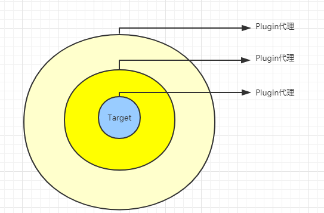

Mybatis插件(Plugin)
----------------

## 目录  
>  前言  


## 前言   

> Mybatis利用接口将各个层进行分离的同时也提供了手段给予编程者去修改mybatis的默认行为，最经典的要属其插件的使用，本节我们就来研究一下。  


## 介绍   
> Mybatis允许用户使用自定义拦截器对sql语句执行过程中的某一点进行拦截，我们可以拦截四大接口(``Executor``,``StatementHandler``,``ParameterHandler``,``ResultSetHandler``)的方法来实现某些功能。  
> 1.使用拦截器需要实现``Interceptor``接口,Interceptor是实现Plugin的核心，其定义如下：  
```java
    public interface Interceptor {
        //执行拦截逻辑的方法
        Object intercept(Invocation var1) throws Throwable;
        
        //决定是否触发interceptor()方法
        Object plugin(Object var1);
        
        //根据配置初始化Interceptor对象
        void setProperties(Properties var1);
    }
```   

除了实现Interceptor接口外，还需要在注解中指明拦截的类和方法：  
```java
    @Intercepts({@Signature(type = Executor.class, method = "query", args = { MappedStatement.class, Object.class,
    		RowBounds.class, ResultHandler.class })})
    public class TableExecutorInterceptor implements Interceptor {
    	private Logger logger = LoggerFactory.getLogger(TableExecutorInterceptor.class);
    
    	/***
    	* 拦截后的操作处理
        */
    	@Override
    	public Object intercept(Invocation invocation) throws Throwable {
    		Object result = invocation.proceed();
    		logger.info("result:{}",result);
    		return result;
    	}
    
    	@Override
    	public Object plugin(Object target) {
    		if (target instanceof Executor) {
    		    //返回代理对象
    			return Plugin.wrap(target, this);
    		} else {
    			return target;
    		}
    
    	}
    
    	@Override
    	public void setProperties(Properties properties) {
    	    //初始化配置的参数
    	}
    
    }
```
针对注解格式做一下说明:  
```
    @Interceptor(
        {
            @Signature(
                type=,//指明拦截的类的名称
                method=,//拦截的方法名
                args={}//拦截的方法的参数列表，通过方法名+参数列表可以匹配指定的方法
            )
        }
    )
```
> 2.配置文件中声明拦截器  
```xml
        <?xml version="1.0" encoding="UTF-8" ?>
        <!DOCTYPE configuration PUBLIC "-//mybatis.org//DTD Config 3.0//EN" "http://mybatis.org/dtd/mybatis-3-config.dtd">
        <configuration>
        	<!-- <environments default="development">
        		<environment id="development">
        			<transactionManager type="JDBC" />
        			<dataSource type="POOLED">
        				<property name="driver" value="com.mysql.jdbc.Driver" />
        				<property name="url" value="jdbc:mysql://localhost:3306/test" />
        				<property name="username" value="root" />
        				<property name="password" value="123456" />
        			</dataSource>
        		</environment>
        	</environments> -->
        	<settings>
        		<!-- 打印查询语句-->
                <setting name="logImpl" value="STDOUT_LOGGING" />
        	</settings>
        	<plugins>
        		<plugin interceptor="test.mybatis.plugins.TablePrepareInterceptor"></plugin>
        	</plugins>
        	
        	<mappers>
        		......
        	</mappers>
        </configuration>
    
```
到此自定义的拦截器就配置好了，在Mybatis初始化时，会通过XMLConfigBuilder.pluginElement()方法解析mybatis-config.xml配置文件中定义的<plugin>节点，得到相应的Interceptor对象以及配置的相应属性，之后会调用Interceptor.setProperties(properties)方法完成对Interceptor对象初始化配置，最后将Interceptor对象添加到Configuration.interceptorChain字段中保存。

## 拦截原理  
> Mybatis中有一个很重要的类-``Configuration``，该配置类为我们提供各种接口实例的获取，其中就包括四大接口，这四种接口对象都是通过
newXXXX()方法获得的，如果配置了拦截器，就会在生成这些对象后，通过interceptorChain.pluginAll(...)来生成代理对象，最终返回的都是代理对象。例如创建Executor对象:  
```java
    
    public Executor newExecutor(Transaction transaction, ExecutorType executorType) {
        executorType = executorType == null ? defaultExecutorType : executorType;
        executorType = executorType == null ? ExecutorType.SIMPLE : executorType;
        Executor executor;
       
        // 根据参数，选择合适的Executor
        if (ExecutorType.BATCH == executorType) {
          executor = new BatchExecutor(this, transaction);
        } else if (ExecutorType.REUSE == executorType) {
          executor = new ReuseExecutor(this, transaction);
        } else {
          executor = new SimpleExecutor(this, transaction);
        }
       
        // 根据配置决定是否开启二级缓存
        if (cacheEnabled) {
          executor = new CachingExecutor(executor);
        }
        
        //通过InterceptorChain.pluginAll()方法创建Executor的代理对象
        executor = (Executor) interceptorChain.pluginAll(executor);
        return executor;
    }

```   
InterceptorChain中使用interceptors字段(ArrayList<Interceptor>类型)记录了mybatis-config.xml文
件中配置的拦截器。在InterceptorChain.pluginAll()方法中会遍历该interceptors集合，并调用其中的每个元素的plugin()方法创建代理对象，创建代理对象的 代理对象，类似于洋葱一样，  
具体的实现如下所示。
```java
    public class InterceptorChain {
      //保存配置的拦截器
      private final List<Interceptor> interceptors = new ArrayList<Interceptor>();
    
      //依次调用plugin生成代理对象
      public Object pluginAll(Object target) {
        for (Interceptor interceptor : interceptors) {
          target = interceptor.plugin(target);
        }
        return target;
      }
    
      public void addInterceptor(Interceptor interceptor) {
        interceptors.add(interceptor);
      }
      
      public List<Interceptor> getInterceptors() {
        return Collections.unmodifiableList(interceptors);
      }
    
    }
```
不当的使用Interceptor的plugin方法生成代理对象是危险的，因为这会改变Mybatis原有的执行流程，很有可能会
导致程序无法运行，为此mybatis为我们提供了``Plugin``类的wrap方法来实现代理的生成，减少出错的可能，因此我们
在重写plugin方法时推荐使用Plugin类。   
```java
public class Plugin implements InvocationHandler {
  private Object target;//目标对象
  private Interceptor interceptor;//拦截器
  private Map<Class<?>, Set<Method>> signatureMap;

  private Plugin(Object target, Interceptor interceptor, Map<Class<?>, Set<Method>> signatureMap) {
    this.target = target;
    this.interceptor = interceptor;
    this.signatureMap = signatureMap;
  }

  public static Object wrap(Object target, Interceptor interceptor) {
    //获取用户自定义Interceptor中@Signature注解的信息，getSignatureMap()方法负责处理@Signture注解
    Map<Class<?>, Set<Method>> signatureMap = getSignatureMap(interceptor);
    
    Class<?> type = target.getClass();
    ////获取目标类型实现的接口，正如前文所述，拦截器可以拦截4类对象都实现了相应的接口，这也是能使用JDK动态代理的方式创建对象的基础
    Class<?>[] interfaces = getAllInterfaces(type, signatureMap);
    if (interfaces.length > 0) {
      //使用JDK动态代理的方式创建代理对象
      return Proxy.newProxyInstance(
          type.getClassLoader(),
          interfaces,
          new Plugin(target, interceptor, signatureMap));
    }
    return target;
  }

  //拦截方法入口
  @Override
  public Object invoke(Object proxy, Method method, Object[] args) throws Throwable {
    try {
      //获取方法签名  
      Set<Method> methods = signatureMap.get(method.getDeclaringClass());
      //判断是否需要拦截
      if (methods != null && methods.contains(method)) {
          //需要拦截，则执行相应的拦截方法
        return interceptor.intercept(new Invocation(target, method, args));
      }
      
      //不需要拦截，则执行原有的方法
      return method.invoke(target, args);
    } catch (Exception e) {
      throw ExceptionUtil.unwrapThrowable(e);
    }
  }

  private static Map<Class<?>, Set<Method>> getSignatureMap(Interceptor interceptor) {
    Intercepts interceptsAnnotation = interceptor.getClass().getAnnotation(Intercepts.class);
    // issue #251
    if (interceptsAnnotation == null) {
      throw new PluginException("No @Intercepts annotation was found in interceptor " + interceptor.getClass().getName());      
    }
    Signature[] sigs = interceptsAnnotation.value();
    Map<Class<?>, Set<Method>> signatureMap = new HashMap<Class<?>, Set<Method>>();
    for (Signature sig : sigs) {
      Set<Method> methods = signatureMap.get(sig.type());
      if (methods == null) {
        methods = new HashSet<Method>();
        signatureMap.put(sig.type(), methods);
      }
      try {
        Method method = sig.type().getMethod(sig.method(), sig.args());
        methods.add(method);
      } catch (NoSuchMethodException e) {
        throw new PluginException("Could not find method on " + sig.type() + " named " + sig.method() + ". Cause: " + e, e);
      }
    }
    return signatureMap;
  }

  private static Class<?>[] getAllInterfaces(Class<?> type, Map<Class<?>, Set<Method>> signatureMap) {
    Set<Class<?>> interfaces = new HashSet<Class<?>>();
    while (type != null) {
      for (Class<?> c : type.getInterfaces()) {
        if (signatureMap.containsKey(c)) {
          interfaces.add(c);
        }
      }
      type = type.getSuperclass();
    }
    return interfaces.toArray(new Class<?>[interfaces.size()]);
  }

}
```
最终方法会进入我们自定义的拦截器interceptor方法中，在该方法中实现自定义的内容，从而达到拦截的目的。  

## 总结  

> 总结一下拦截器的处理流程：  
* SqlSession执行相应方法时，通过Configuration类获取对象的四大接口对象  
* Configuration根据config.xml中配置的plugin生成代理对象返回  
* 当调用代理对象的方法时，进入Plugin对象的invoke方法，根据方法签名判断是否需要拦截该方法，不需要拦截则继续执行原方法；需要拦截的则进入自定义拦截器的intercept方法  
* 继续执行  
