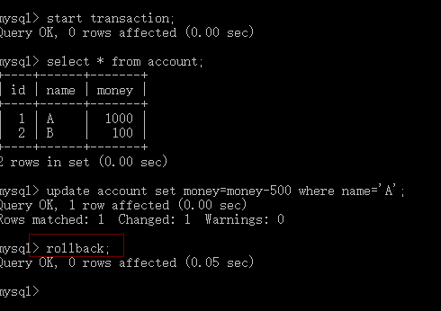

Mybatis事务管理
----------------

## [目录]  
> [事务的特性](#事务的特性)  
> [事务的隔离级别介绍](#事务的隔离级别)   
>> [事务带来的问题](#事务带来的问题)       
>> [通过事务隔离来解决问题](#通过事务隔离来解决问题)  
> [事务原理](#事务原理)  
>> [JDBC事务实现](#JDBC事务实现)  
>> [Mybatis事务实现](#Mybatis事务实现)  
>> [啰嗦一下](#啰嗦一下)  


## 事务的特性  
> 事务的四个特性（ACID）已经是老生常谈的话题，想必各位已经都熟记于心，这里就帮大家快速的回忆一下:  
* 原子性(Atomicity): 体现在同一个事务的操作要么一起成功，要么集体失败。  
* 一致性(Consistent): 表现在事务执行前后系统是整体稳定的，比如对于出入账操作不会存在总资金的变化。  
* 隔离性(Isolation): 变现在各个事务之间是相互隔离的，不会相互影响。  
* 持久性(Durability): 事务一旦执行成功了，对于数据库的修改是永久性的。  

## 事务的隔离级别   
> 在讲事务的隔离级别之前，先分析一下事务的引入在并发的情况下会遇到什么样的问题。  
### 事务带来的问题  
#### 脏读  
> 考虑转账的情况：  

  
1. 账号A, 开启事务1，自己账户减500，通知B,我已经转账你了，你看我的账号都减了;  
  

2. 账号B, 开启事务2，进行了查询操作，发现账户A确实减了(此时事务1还未提交，已经发生了脏读), 自己账户增加500，提交事务;  
   

3. 账号A, 因为一些问题，回滚事务;  
   

4. 最终发现账号A钱数没减，账号B钱数增加了500，但是这500事实上不存在;  
  

> 像上面这样的情况，事务2读取到事务1未提交的数据，就发生了脏读。


### 不可重复读  
> 同样是上面转账的情景，此外银行还有一个策略（当银行账户钱数少于500时即冻结账户）：  

  
1. 账号A, 开启事务1，自己账户减500，通知B,我已经转账你了，你看我的账号都减了;  
  

2. 账号B, 开启事务2，进行了查询操作，发现账户A确实减了，同时A的账户到达了最低值，异步锁定了账户A并通知A解锁;  
   

3. 账号A, 因为一些问题，回滚事务1，账号B一看A不转了，那我也不加了，回滚事务2;  
   

4. 最终发现账号A钱数没有小于500，但是A很奇怪，我的账户咋不能用了,投诉就来了;  
  

> 像上面的情况，在一个事务里,因为另一个事务修改操作，导致同一个事务前后读取的数据不一致，就造成了不可重复读的问题。  


### 幻读  
>   这次不是转账了，是银行搞活动，存款大于1000的送100(想得美)：  

1. 事务1，查看当前存款大于1000的用户，给这些账号送钱;  
2. 事务2，存款1500，提交事务;  
3. 事务1，看看送钱的结果，我擦，咋有个用户没有送钱;  
   
> 像上面的情况，在一个事务里，因为另一个事务删除或者插入的操作，导致同一个事务里的数据前后不一致，就造成了幻读的问题。   
 
 
### 丢失更新  
> 除了上面提到的这些问题，还有一种问题会出现，那就是丢失更新的问题：  


### 皮一下  
   
> 当你明白舍生取义，就会回来和我一起唱这首歌了," 当当当。。。"（跑题了）   

### 通过事务隔离来解决问题  
> 既然事务带来这么多的问题，但是我们还要用事务，有没有什么好的办法去解决呢？ 答案是有的，这就要引入我们事务隔离机制了。  
根据处理的不同，事务的隔离级别分为四种：  

|隔离级别|特点|  
|:--|:--|  
|none||  
|read_uncommitted|读未提交：脏读、不可重复读、幻读均不能避免|  
|read_committed|读已提交：避免脏读；不可重复读，幻读不能避免|  
|repeatable_read|可重复读：避免脏读、不可重复读；幻读不能避免|  
|serializable|序列化：避免脏读、不可重复读、幻读；不能解决丢失更新的问题|    

 > mysql默认的事务隔离级别是repeatable_read  
 
 ## 事务原理    
 
 ### JDBC事务实现
 
 > 我们先来看看jdbc方式如何实现事务操作   
 ```java
    import java.sql.*;
    /**
    * jdk>=1.7 
    */
    public class JdbcTransactionTest{
        private static String driverClass = "com.mysql.jdbc.Driver";
        private static String url = "jdbc:mysql://localhost:3306/zhiyun_os?useUnicode=true&characterEncoding=UTF-8&useSSL=true";
        private static String userName = "root";
        private static String password = "123456";
        
        static {
            Class.forName(driverClass);
        }
        
        public static Connection getConnection() throws SQLException{
            return DriverManager.getConnection(url,userName.password);
        }
        
        public static void transactionTest(){
            Connection connection = getConnection();
            //需要关闭自动提交，否则数据库会为每一条sql建立一个新的事务
            connection.setAutoCommit(false);
            try{
                //update operation
                //insert operation
                //select operation
                //事务提交
                connection.commit();
            }catch (Exception e){
                //异常，事务回滚
                if(null!=connection){
                    connection.rollback();
                }
            }finally{
                close(connection);
            }
        }
        
        public static void close(AutoCloseable closeable){
            if(null!=closeable){
                closeable.close();
            }
        }
    }
```
我们看到，事务是依托Connection操作完成的，那我们大胆的猜想一下，Mybatis肯定也是通过某种手段来按照标准jdbc的方式来操作事务，只是隐藏起来了，这里我们似乎闻到了一丝原理的气息，嘿嘿嘿~  

### Mybatis事务实现  
> 先看下mybatis是如何操作事务的：  

mybati-config.xml
```xml
<?xml version="1.0" encoding="UTF-8" ?>
<!DOCTYPE configuration  PUBLIC "-//mybatis.org//DTD Config 3.0//EN" "http://mybatis.org/dtd/mybatis-3-config.dtd">
<configuration>
	<environments default="development">
		<environment id="development">
			<transactionManager type="JDBC" />
			<dataSource type="POOLED">
				<property name="driver" value="com.mysql.jdbc.Driver" />
				<property name="url" value="jdbc:mysql://localhost:3306/test" />
				<property name="username" value="root" />
				<property name="password" value="123456" />
			</dataSource>
		</environment>
	</environments> 
	<mappers>
		<mapper resource="mapper/UserMapper.xml" />
	</mappers>
</configuration>
```
```java
    public class MybatisTransactionTest{
    
         public static void main(String[] args) throws IOException {
                String resource = "mybatis-config.xml";
                InputStream inputStream = Resources.getResourceAsStream(resource);
                SqlSessionFactory sqlSessionFactory = new SqlSessionFactoryBuilder().build(inputStream);
                
                try(SqlSession openSession = sqlSessionFactory.openSession()){
                    /**
                    * openSession.insert(...);
                    * openSession.update(...);
                    * openSession.select(...);
                    */
                    openSession.commit();
                }catch (Exception e){
                    openSession.rollBack();
                }
                
            }
    }

```
> 回顾一下我们之前讲的，SqlSession是mybatis暴露给我们的外部接口，代表着一个数据库连接，一次回话，那我们可以简单的理解为对Connection的抽象(实际不是),我们看看mybatis是如何完成事务的，从openSession()开始：  
```java
    //DefalutSqlSessionFactory
    private SqlSession openSessionFromDataSource(ExecutorType execType, TransactionIsolationLevel level, boolean autoCommit) {
        Transaction tx = null;
        try {
          final Environment environment = configuration.getEnvironment();
          //获取事务工厂类
          final TransactionFactory transactionFactory = getTransactionFactoryFromEnvironment(environment);
          //创建事务
          tx = transactionFactory.newTransaction(environment.getDataSource(), level, autoCommit);
          //事务注入到Executor,我们知道Executor是真正的执行者
          final Executor executor = configuration.newExecutor(tx, execType);
          return new DefaultSqlSession(configuration, executor, autoCommit);
        } catch (Exception e) {
          closeTransaction(tx); // may have fetched a connection so lets call close()
          throw ExceptionFactory.wrapException("Error opening session.  Cause: " + e, e);
        } finally {
          ErrorContext.instance().reset();
        }
      }

```
我们发现在创建一个SqlSession会话时，就已经开启了一个事务，我们来看看openSession.commit()和rollBack()方法，直接去BaseExecutor中查看：  
```java
    
  @Override
  public void commit(boolean required) throws SQLException {
    if (closed) {
      throw new ExecutorException("Cannot commit, transaction is already closed");
    }
    //清理缓存
    clearLocalCache();
    flushStatements();
    if (required) {
        //事务提交
      transaction.commit();
    }
  }

  @Override
  public void rollback(boolean required) throws SQLException {
    if (!closed) {
      try {
        clearLocalCache();
        flushStatements(true);
      } finally {
        if (required) {
            //事务提交
          transaction.rollback();
        }
      }
    }
  }
```
于是我们想，事务又是如何提交和回滚的，我们想到了jdbc是通过Connection来操作的，其实Mybatis也是如此，我们来看实现类``JdbcTransaction``  
```java
public class JdbcTransaction implements Transaction {

  protected Connection connection;
  protected DataSource dataSource;
  protected TransactionIsolationLevel level;
  protected boolean autoCommmit;

  public JdbcTransaction(DataSource ds, TransactionIsolationLevel desiredLevel, boolean desiredAutoCommit) {
    dataSource = ds;
    level = desiredLevel;
    autoCommmit = desiredAutoCommit;
  }


  @Override
  public Connection getConnection() throws SQLException {
    if (connection == null) {
      openConnection();
    }
    return connection;
  }

  @Override
  public void commit() throws SQLException {
    if (connection != null && !connection.getAutoCommit()) {
      if (log.isDebugEnabled()) {
        log.debug("Committing JDBC Connection [" + connection + "]");
      }
      connection.commit();
    }
  }

  @Override
  public void rollback() throws SQLException {
    if (connection != null && !connection.getAutoCommit()) {
      if (log.isDebugEnabled()) {
        log.debug("Rolling back JDBC Connection [" + connection + "]");
      }
      connection.rollback();
    }
  }

  @Override
  public void close() throws SQLException {
    if (connection != null) {
      resetAutoCommit();
      if (log.isDebugEnabled()) {
        log.debug("Closing JDBC Connection [" + connection + "]");
      }
      connection.close();
    }
  }

  protected void setDesiredAutoCommit(boolean desiredAutoCommit) {
    try {
      if (connection.getAutoCommit() != desiredAutoCommit) {
        if (log.isDebugEnabled()) {
          log.debug("Setting autocommit to " + desiredAutoCommit + " on JDBC Connection [" + connection + "]");
        }
        connection.setAutoCommit(desiredAutoCommit);
      }
    } catch (SQLException e) {
      // Only a very poorly implemented driver would fail here,
      // and there's not much we can do about that.
      throw new TransactionException("Error configuring AutoCommit.  "
          + "Your driver may not support getAutoCommit() or setAutoCommit(). "
          + "Requested setting: " + desiredAutoCommit + ".  Cause: " + e, e);
    }
  }

  protected void resetAutoCommit() {
    try {
      if (!connection.getAutoCommit()) {
        // MyBatis does not call commit/rollback on a connection if just selects were performed.
        // Some databases start transactions with select statements
        // and they mandate a commit/rollback before closing the connection.
        // A workaround is setting the autocommit to true before closing the connection.
        // Sybase throws an exception here.
        if (log.isDebugEnabled()) {
          log.debug("Resetting autocommit to true on JDBC Connection [" + connection + "]");
        }
        connection.setAutoCommit(true);
      }
    } catch (SQLException e) {
      if (log.isDebugEnabled()) {
        log.debug("Error resetting autocommit to true "
          + "before closing the connection.  Cause: " + e);
      }
    }
  }

  protected void openConnection() throws SQLException {
    if (log.isDebugEnabled()) {
      log.debug("Opening JDBC Connection");
    }
    connection = dataSource.getConnection();
    if (level != null) {
      connection.setTransactionIsolation(level.getLevel());
    }
    setDesiredAutoCommit(autoCommmit);
  }

  @Override
  public Integer getTimeout() throws SQLException {
    return null;
  }
  
}
```
> 可以看到事务的操作最终还是回归到最原始的JDBC操作了，看到这里我想大家应该可以总结出来一些内容了吧：  
我们开启一次回话默认会开启一个新的事务，回话的提交和回滚最后还是通过事务的回滚和提交来操作的。那问题就归结到事务Transaction对象怎么通过TransactionFactory创建的。  

> 我们来看看TransactionFactory的类图：  

  
其中：ManagedTransactionFactory表示将事务委托给第三发服务去处理，比如JBoss，其生成的ManagedTransacton内部也是什么都不做。  
JdbcTransactionFactory表示通过jdbc的事务机制来实现事务，这也是我们常用的实现方式，当然与spring集成时使用的是SpringTransactionFactory其实也是通过jdbc实现的变种，这里不做介绍。至于使用JDBC还是Manager我们可以在mybatis-config.xml中配置：  

### 总结一下  
> 自此我们对Mybatis的事务就了解的差不多了，总结一下：  
* Mybatis自身不处理事务，而是将提供事务接口TransactionFactory，由外界注入处理处理事务，只是其默认提供了JDBC和Managed两种模式。  
* 新建一个回话就会开启一个事务，回话的提交和回滚最终都是由事务的提交和回滚完成的。

### 啰嗦一下  
> 说道Mybatis事务不得不说Spring事务管理，简单说Spring集成Mybatis管理事务时，内部使用的还是标准JDBC去完成事务的操作，只是spring通过AOP在我们执行方法前后自动的完成了事务的操作。


   

 


